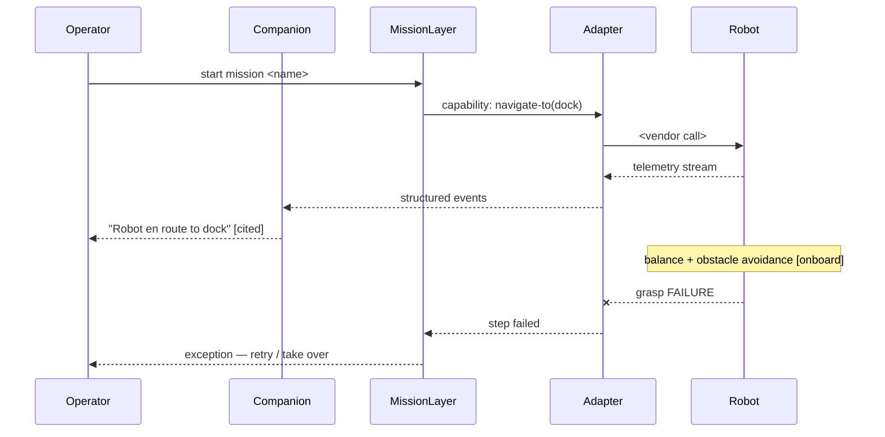

# OpenSpec Robotics Flow — methodology

> A dedicated spec-driven flow for robotics work. It defines how a robotics program's *intent, integration and coordination* layer is captured in OpenSpec artefacts — capability-spec templates, a sequence-diagram convention, and a role model — so that twelve mutually-unintelligible specialties share one review surface without abandoning their native tools.
>
> This document is the contract for *how* robotics changes are specced. It is a sibling of [`cli-standards.md`](./cli-standards.md) and [`agent-model-mapping.md`](./agent-model-mapping.md) under `openspec/_methodology/tools/`.

---

## Status

**Draft — not yet applied through a change.** Authored from three research documents compiled May 2026:

- [`../research/robot-operator-interfaces.md`](../research/robot-operator-interfaces.md) — platforms, transports, operator-UI vendors.
- [`../research/robot-developer-pain-points-and-openspec.md`](../research/robot-developer-pain-points-and-openspec.md) — where spec-driven development fits (4 STRONG / 6 PARTIAL / 4 NO FIT across 14 pain points).
- [`../research/robot-ecosystem-roles-and-vendors.md`](../research/robot-ecosystem-roles-and-vendors.md) — the twelve roles, the Tower of Babel diagnosis, the convergence analysis.

Visual companion: [`../research/openspec-robot-stack-coverage.svg`](../research/openspec-robot-stack-coverage.svg).

This flow becomes canonical only when promoted via an OpenSpec change (provisional scaffold: `openspec/archive/2026-05-21-add-robot-operator-surface-platform/`). Until then it is a reviewed draft; enforcement is by review, not by lint.

---

## Why this flow exists

A robotics program is not one discipline. It is roughly **twelve specialties** — robotics software engineer, integration engineer, controls engineer, behaviour/autonomy engineer, perception/ML engineer, HRI designer, robotics UX designer, frontend/operator-UI engineer, RobOps engineer, simulation engineer, functional-safety engineer, product manager — and they share neither a file format, nor a review ritual, nor a definition of "done" (full evidence: research doc 3, § 5).

The same event — "the robot picks up the box and carries it to the dock" — is twelve facts in twelve namespaces. The cost concentrates at **handoffs**: the behaviour engineer's failure modes and the UX designer's exception screens are the same set, represented twice, kept in sync by hope.

Every prior attempt to unify these roles either converged one seam and stopped (ROS REPs, VDA 5050) or attempted total convergence with a heavyweight model and was rejected role-by-role on adoption cost (MBSE/SysML). The decisive lesson: **a unification artefact that asks any role to abandon its native tool will be rejected by that role.**

This flow therefore makes a deliberately modest claim. It is **the shared review surface and the handoff contract** — the one artefact all roles read, even though each still works in Groot, Simulink, Figma, PyTorch or the hazard log. It is the index and the contract; the native tools remain the workshops.

---

## Scope

### In scope — the declarative upper stack

This flow covers the artefacts that are *primarily intent, agreement and coordination* — natural-language-shaped, reviewable, evolvable via delta specs. By the latency law (research doc 1 / the SVG), this is the part of the stack above the ~200 ms budget: task layer, mission layer, fleet coordination, the adapter seam, operator surfaces, configuration. Roughly **30–40 %** of a robot program's surface area.

### Out of scope — the real-time lower stack

This flow does **not** describe, and must never pretend to describe:

| Excluded | Owned by | Why |
|---|---|---|
| Kinematics, dynamics, geometry | URDF / SDF / MJCF / USD | Numeric, solver-consumed; a fourth prose description would be lossy and drift. |
| Real-time control loops, timing/jitter contracts | RTOS scheduler, WCET analysis, control code | Markdown cannot express a schedulability proof. |
| Control-law correctness, stability | Lyapunov / reachability / STL | Prose has no quantitative semantics. |
| Perception model weights, fusion numerics | training infra, the model | Statistical properties established by data, not prose. |
| Formal safety verification, certification traceability | DOORS / Polarion / Jama, ISO 26262 / IEC 61508 / DO-178C | An assessor will not accept "see `proposal.md`." |
| Behaviour-tree tick semantics | BehaviorTree.CPP, Groot | The XML is the executable artefact; the spec references it. |

A robotics spec **references** these artefacts (`references: arm.urdf`) and never restates them.

---

## Principles

**P1 — Shared review surface, not shared tool.** The flow's job is to be the one artefact all twelve roles read, not to replace any role's workshop. The behaviour engineer keeps Groot; the spec carries the *list* of mission steps and failure modes in prose-plus-diagram, where the UX designer and the PM can read it.

**P2 — The PM is the sponsor.** The PM is the only role that already owns a cross-role artefact (the PRD) and it is non-binding prose. The highest-leverage move is to give the PM a structured spec the other roles are obliged to read. Robotics changes are PM-sponsored by default.

**P3 — Cheaper to adopt than to ignore.** The MBSE post-mortem is unambiguous: front-loaded per-role adoption cost kills unification artefacts. If reading `design.md` takes a UX designer longer than the Slack thread it replaces, the flow has failed. Templates stay short.

**P4 — Reference, never restate.** Every excluded artefact (URDF, BT XML, hazard log, control gains) is linked, never re-described. Restating an executable artefact in prose creates a fourth lossy copy that drifts.

**P5 — The adapter seam is the unit.** Each adapter = one capability spec. The ecosystem grows by adding adapter specs and capability contracts, not by rewriting the system. This is what makes the product architectural-procedural rather than bespoke-per-robot.

---

## §1 How the robotics flow sits inside the standard OpenSpec workflow

The studio's standard flow is unchanged: a change lives in `openspec/changes/<slug>/` as `proposal.md` + `design.md` + `tasks.md`, capability specs live in `openspec/current/`, the cycle is propose → apply → archive (see [`openspec/AGENTS.md`](../../AGENTS.md)).

The robotics flow adds **four capability-spec templates** (§2) and **one diagram convention** (§3) to that workflow. It changes nothing else. A robotics change is an ordinary OpenSpec change whose `design.md` carries the §3 sequence diagram and whose `openspec/current/` deltas use the §2 templates.

Capability specs for robotics live under `openspec/current/robot-*` — e.g. `openspec/current/robot-operator.md`, `openspec/current/robot-adapters/<vendor>.md`, `openspec/current/robot-missions/<mission>.md`.

---

## §2 Capability-spec templates

Four templates. Each is a markdown skeleton to copy into `openspec/current/`. They are deliberately short (P3). Fields in `<angle brackets>` are filled per instance.

### §2.1 Adapter interface contract

One per vendor robot. This is the seam between the closed lower stack and the describable upper stack — the artefact that gives the diffuse, identity-less "adapter writer" work (research doc 3, § 2) a reviewable home.

```markdown
# Adapter: <vendor> <robot/model>

## Transport
- Protocol: <ROS 2 + Foxglove Bridge | VDA 5050 | MAVLink | Spot SDK gRPC | DJI Cloud API | HTTPS REST>
- Deployment shape: <cloud Worker | on-prem service | hybrid>

## Commands exposed (semantic vocabulary)
| Studio verb | Vendor call | Notes |
|---|---|---|
| move_to     | <…>         | <…>   |
| pick        | <…>         | <…>   |

## Telemetry published
| Field | Type | Rate | Source topic/call |
|---|---|---|---|

## Vendor dialect quirks
- <e.g. "this vendor's `pause` actually means `slow`">

## Failure modes
| Mode | Detection | Adapter behaviour |
|---|---|---|

## Fallback on disconnect
- <safe-stop | continue last plan | …> — the adapter MUST define this.

## References
- Vendor SDK docs: <link>   ·   Robot model: <arm.urdf link>
```

### §2.2 Robot capability contract

What a robot can be *asked to do* at the task level. Capability, not kinematics (P4).

```markdown
# Capability: <name>   (e.g. pick, navigate-to, inspect-waypoint, charge)

## Latency class
<task (0.1–2 Hz) | mission (sec–min)>   — must be in the describable band; see Scope.

## Preconditions
- <…>

## Postconditions
- <…>

## Parameters
| Name | Type | Required | Meaning |
|---|---|---|---|

## Failure modes
| Mode | Cause | Expected handling |
|---|---|---|

## Conforms to
- Registered in: openspec/current/robot-ecosystem.md  (the capability registry)
```

### §2.3 Mission / workflow spec

The intended sequence and branching of a multi-step operation — the level *above* the behaviour-tree XML. References the BT, does not restate it (P4). This is "any workflow described in OpenSpec" made concrete.

```markdown
# Mission: <name>

## Steps (sequence)
1. <step> — capability: <ref to §2.2 contract>
2. <step> — capability: <…>

## Branching / fallback
- If <step> fails: <retry N | escalate to operator | abort>

## Failure modes per step
| Step | Failure mode | Operator-visible? | Handoff → UX (§2.4) |
|---|---|---|---|

## Acceptance criteria  (Given/When/Then)
- Given <…>, when <…>, then <…>

## Referenced artefacts
- Behaviour tree: <mission.btproj link — executable artefact, not restated>
- Sequence diagram: see this change's design.md (§3 convention)
```

### §2.4 Handoff contract

The flow's keystone. It pins one inter-role seam so the two roles stop maintaining the same set twice. The studio operates primarily on two seams: **behaviour ↔ UX** (tree failure modes = exception screens) and **integration ↔ frontend** (adapter telemetry = UI data model).

```markdown
# Handoff: <producer role> → <consumer role>

## Seam
<e.g. behaviour engineer → UX designer>

## Canonical shared set
The single list both roles work from. Defined once, here.
| Item | Producer representation | Consumer representation |
|---|---|---|
| <failure mode / telemetry field / state> | <BT node status> | <exception card> |

## Ownership
- Updates to the canonical set are owned by: <role>
- Change to the set triggers review by: <the other role>

## Review trigger
- This contract is re-reviewed whenever <the mission spec changes | the adapter spec changes>.
```

---

## §3 Sequence-diagram convention

Every robotics change's `design.md` carries at least one sequence diagram. It is the artefact all twelve roles can read at once — the antidote to the twelve-vocabularies problem (P1).

**Format:** Mermaid `sequenceDiagram`, fenced in `design.md`.

**Participants** are systems and roles, named consistently across all studio robotics specs:

```
Operator · Companion · MissionLayer · Adapter · Robot · Fleet
```

**Rules:**

- One diagram per mission or per handoff. Do not draw the whole program in one diagram.
- Show the **fallback path** explicitly — the autonomy-fallback / handover moment is the highest-value interaction (research doc 1, § 5.3) and must be visible.
- The AI-companion narration is a participant (`Companion`), not a side-note — its messages are `retrieval-only` and cite events (see `add-robot-operator-surface-platform/design.md` § 6.1).
- Latency-sensitive arrows (anything that must beat ~200 ms) are annotated `[onboard]` so a reader sees instantly what cannot be specced behaviourally.

**Skeleton:**

````markdown

````

---

## §4 Role model — who writes, who reviews, who reads

Each robotics artefact has one **author**, a small set of **mandatory reviewers**, and a broad set of **readers**. This is what makes the spec a shared review surface rather than another siloed document.

| Artefact | Author | Mandatory reviewers | Readers (obliged) |
|---|---|---|---|
| `proposal.md` | Product manager | — | all roles |
| `design.md` + §3 diagram | PM + lead engineer | behaviour, integration, UX | all roles |
| §2.1 Adapter interface contract | Integration engineer | frontend/operator-UI engineer | RobOps, PM |
| §2.2 Robot capability contract | Behaviour/autonomy engineer | PM | UX, frontend, RobOps |
| §2.3 Mission / workflow spec | Behaviour engineer + PM | UX, simulation | frontend, RobOps, safety |
| §2.4 Handoff contract (behaviour↔UX) | Behaviour engineer | UX designer | frontend, PM |
| §2.4 Handoff contract (integration↔frontend) | Integration engineer | frontend engineer | PM |
| `tasks.md` | PM | lead engineer | all roles |

Roles **not** in the author column for any artefact — controls engineer, perception/ML engineer, functional-safety engineer — interact with the flow only at their *interfaces*: a capability contract may state "the controller meets settling-time requirement X" or "the detector meets confidence threshold Y" as a referenced requirement. Their interiors (gains, weights, the hazard log) stay in their own tools (P4). Pulling them *into* the spec repeats the MBSE mistake.

---

## §5 Honest limits

This flow is connective tissue, not a replacement organ. It will not:

- **Replace formal artefacts where formality is load-bearing.** The safety case feeds a certification-body review; the spec may *reference and summarise* it, never *be* it. Selling a markdown repo as a certification deliverable is a liability, not a feature.
- **Capture controls or perception deep work.** State-space models and trained weights are not markdown-expressible and must not be forced in.
- **Survive if it becomes heavyweight or mandatory-on-day-one.** Templates stay short; adoption stays per-seam and voluntary until value is visible.
- **Eliminate the twelve toolchains.** It unifies the review surface and the handoff seams. The workshops stay.

The defensible claim, and the only one this flow makes: *we give your twelve specialists one document they all read, that pins intent and failure modes at the seams.* Not *one model of the whole robot* — that is the MBSE claim, and the graveyard is full of it.

---

## References

- Research: [`../research/robot-operator-interfaces.md`](../research/robot-operator-interfaces.md), [`../research/robot-developer-pain-points-and-openspec.md`](../research/robot-developer-pain-points-and-openspec.md), [`../research/robot-ecosystem-roles-and-vendors.md`](../research/robot-ecosystem-roles-and-vendors.md)
- Diagram: [`../research/openspec-robot-stack-coverage.svg`](../research/openspec-robot-stack-coverage.svg)
- Provisional change scaffold: `openspec/archive/2026-05-21-add-robot-operator-surface-platform/`
- Sibling methodology docs: [`cli-standards.md`](./cli-standards.md), [`agent-model-mapping.md`](./agent-model-mapping.md)
